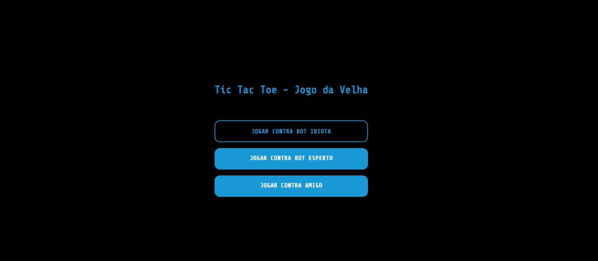
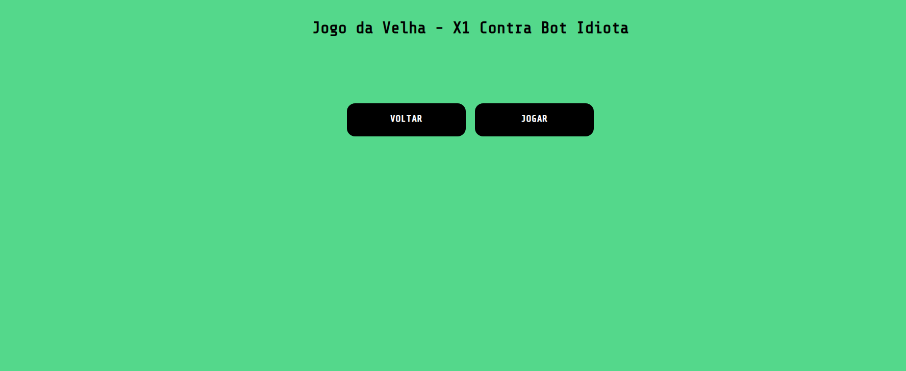
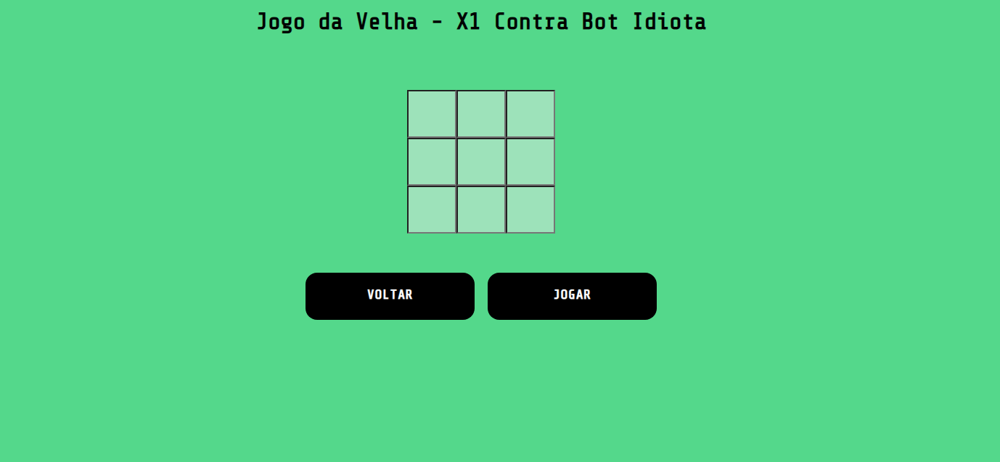
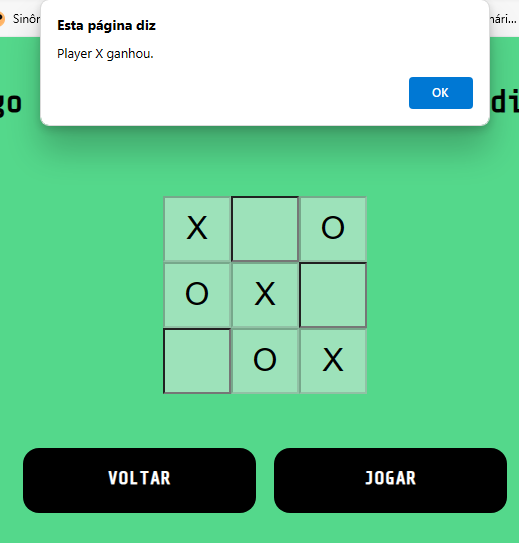
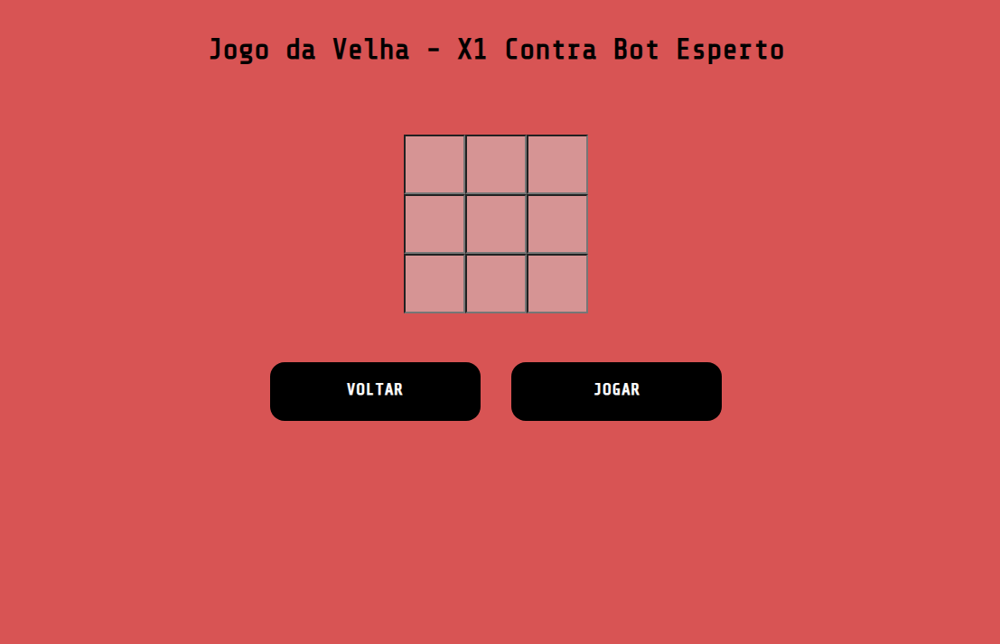
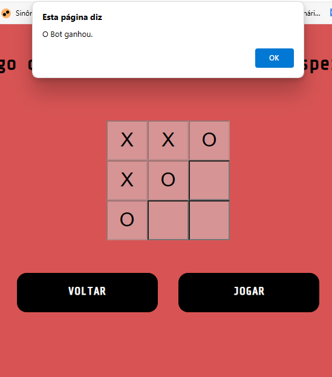
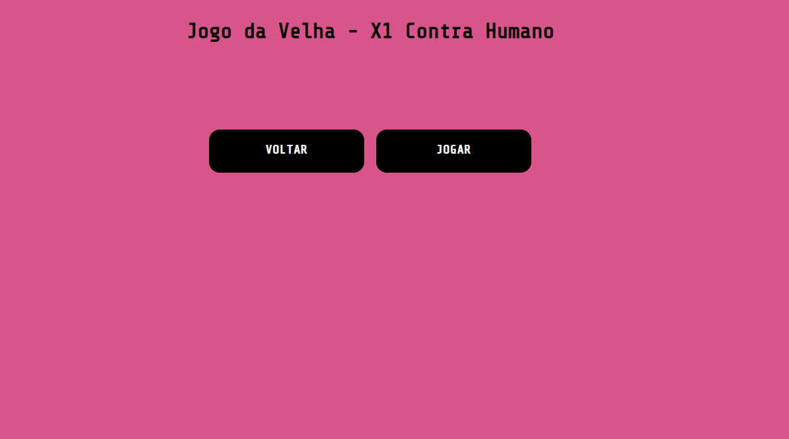
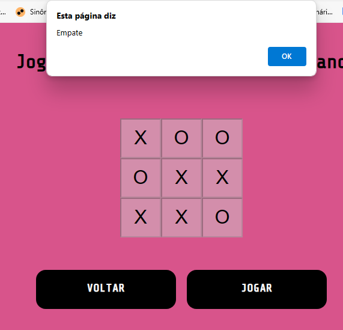

# js-JogoDaVelha-Bot-Humano
um jogo da velha que eu fiz no javascript para jogar contra humano e contra bot. tem bot burro e bot esperto. o bot esperto conhece suas limitações assim como eu conhecia as minhas neste projeto já que eu estava começando a aprender js. quando eu aprender jquery eu volto pra cá.
  

  <h3>Tela inicial</h3>
  

 

  <h3>Antes de começar e depois que aperta o botão para começar</h3>
  

 

  <h3>Na vitória</h3>
  

 

  <h3>Apesar de tudo, o bot esperto é esperto contra certas jogadas</h3>
  

 

  <h3>Tela contra jogador humano</h3>
  

 
